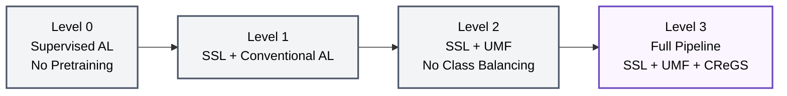
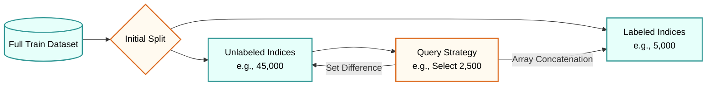

# SSAL Research Framework
**A Modular Framework for Self-Supervised Class-Balanced Active Learning**

## 📖 Overview

Deep Active Learning (DeepAL) drastically reduces the human annotation bottleneck by iteratively querying only the most informative samples for labeling. However, standard DeepAL pipelines suffer from a severe "cold-start" problem: the lack of early labeled data prevents the formation of stable feature representations, leading to suboptimal and noisy querying. 

This framework investigates the integration of **Self-Supervised Learning (SSL)** to mitigate this vulnerability by constructing robust latent spaces from unlabeled data prior to active sampling. It serves as a reproducible research platform to systematically evaluate how structurally diverse SSL paradigms interact with AL acquisition functions, specifically focusing on a novel **Uncertainty-Mastery Fusion (UMF)** metric and **Class-Rebalanced Group Sampling (CReGS)**.

---

## 🏗️ Core Architecture

The framework is strictly **Active Learning-centric**, treating SSL as a pluggable representation learning component.

```mermaid
graph LR
    classDef data fill:#e8f4f8,stroke:#2b6cb0,stroke-width:2px,color:#000;
    classDef ssl fill:#fefcbf,stroke:#dd6b20,stroke-width:2px,color:#000;
    classDef al fill:#ebf4ff,stroke:#4c51bf,stroke-width:2px,color:#000;
    classDef eval fill:#fff5f5,stroke:#e53e3e,stroke-width:2px,color:#000;

    %% Data Initialization
    Data[(Raw Dataset)]:::data --> Pools[Initial Pools:<br/>e.g., 5k Labeled<br/>45k Unlabeled]:::data

    %% SSL Path (Top)
    Pools -->|Unlabeled Pool| SSL[SSL Pretraining:<br/>Rotation / SimCLR<br/>DeepCluster / MAE]:::ssl
    SSL --> RN[Init ResNet-18<br/>Feature Space]:::ssl

    %% Training & Active Learning Loop (Middle/Bottom)
    Pools -->|Labeled Pool| Train[Supervised Training]:::al
    RN --> Train
    
    Train --> Score[UMF Scoring:<br/>Uncertainty + Mastery]:::al
    Score --> CReGS[CReGS:<br/>Class Balancing]:::al
    CReGS --> Query[Oracle Queries<br/>Top Samples]:::al
    Query --> Update[(Update Pools)]:::data
    
    %% The Loop
    Update -->|Next AL Round| Train

    %% Stopping
    Update -.->|Budget Reached| Eval([Final Evaluation]):::eval
```

🔬 Scope and Supported Modules (Version 1.0)To maintain experimental fairness and rigorous benchmarking, this framework restricts its scope to meticulously tested components.  1. Supported DatasetsCIFAR-10 (Primary benchmark)  CIFAR-100  FashionMNIST  SVHN  STL-10 (Crucial for testing Out-of-Distribution / OOD robustness)  TinyImageNet  2. Self-Supervised Pretraining ParadigmsRotation Prediction (Predictive)  SimCLR (Contrastive)  DeepCluster (Clustering)  Masked Autoencoder / MAE (Generative)  3. Active Learning Query StrategiesRandom Sampling (Control Baseline)  Least Confidence (Uncertainty)  Entropy (Uncertainty)  CoreSet (Representative / Diversity)  BADGE (Information-Based)  Hybrid (Entropy + Diversity)  Uncertainty-Mastery Fusion (UMF) (Proposed)  UMF + CReGS (Proposed with Class Rebalancing)  🧪 Evaluation Methodology: 4-Level Ablation MatrixThe project isolates the contributions of representation learning versus sample acquisition logic using a strict 4-level ablation progression.  Code snippet

🧮 Key Mechanisms: UMF & CReGSUncertainty-Mastery Fusion (UMF)To accurately quantify sample informativeness, the UMF metric avoids querying noisy outliers by fusing predictive uncertainty with structural density peak clustering. The sample information measurement $I_{umf}$ is computed as:
  $$I_{umf}(x) = \mathbb{E}_{p \sim (f \circ \mathcal{M})(x)}[-\log p] \cdot (\gamma \cdot \delta)$$
where $\gamma$ is the local feature density and $\delta$ is the minimum distance to a higher-density sample[cite: 5].Class-Rebalanced Group Sampling (CReGS)Standard uncertainty sampling inherently induces severe distributional skew[cite: 5]. CReGS counteracts this by partitioning unlabeled candidates into groups and enforcing an adaptive sampling quota $b_c$ for each class $c$[cite: 5]:
$$b_{c}=\begin{cases} \lfloor\overline{n}_{c}-n_{c}+\frac{B}{\vert{}C\vert{}}+\epsilon_{c}\rfloor, & \text{if } c \in \hat{C} \\ 0, & \text{otherwise} \end{cases}$$
This minimizes the divergence between the empirical batch distribution and the population distribution, actively neutralizing progressive learning bias[cite: 5].🗃️ Active Learning Pool ManagementTo prevent data leakage and guarantee scientific validity, the test set never participates in the query process. The framework strictly manages state changes by transferring indices from the Unlabeled Pool to the Labeled Pool after each oracle query, ensuring no duplications occur.  Code snippet

⚙️ Software Architecture & Directory StructureThe framework is packaged as a professional, installable Python module (ssal).Plaintextssal-research-framework/
├── configs/                  # Hydra hierarchical configurations
│   ├── active_learning/      # Random, Entropy, UMF, etc.
│   ├── dataset/              # CIFAR-10, STL-10, etc.
│   ├── experiment/           # Master AL protocol templates
│   └── model/                # ResNet-18 definitions
├── src/ssal/                 # Core framework package
│   ├── active_learning/      # Pool management and AL orchestrator
│   ├── data/                 # BaseDataModule and Dataset specific loaders
│   ├── evaluation/           # Metrics calculation
│   ├── experiments/          # W&B trackers
│   ├── models/               # Classifier heads and SSL backbones
│   ├── training/             # Modular supervised and SSL trainers
│   └── utils/                # Reproducibility (seeds) and device management
├── tests/                    # Pytest suite (Unit & Integration)
├── notebooks/                # Exploratory diagnostics (e.g., 2D synthetic AL)
└── pyproject.toml            # Build system and dependency definitions
💻 Installation & Usage1. Environment SetupThe framework mandates Python 3.11 for strict reproducibility in PyTorch environments.  Bashpython3.11 -m venv .venv
source .venv/bin/activate
pip install --upgrade pip setuptools wheel
2. Install the PackageInstall the framework in editable mode with development dependencies:Bashpip install -e ".[dev]"
(To include Weights & Biases for experiment tracking, use pip install -e ".[dev,tracking]").  3. Running an ExperimentThe framework utilizes Hydra for zero-code configuration overrides. To execute a baseline Active Learning loop:  Bashpython -m ssal.main \
    experiment=l0_cifar10 \
    active_learning=entropy \
    model=resnet18 \
    seed=42
🛡️ Coding Standards & ReproducibilityDeterministic Seeding: Universal random seeds applied across NumPy, Python, and PyTorch (CPU, CUDA, and Apple MPS).  Linting: Codebase is strictly formatted and checked using ruff.  Testing: High-coverage unit and integration testing via pytest.  🚀 Current Roadmap Status[x] Phase 1: Research & AL Fundamentals Audit.  [x] Phase 2: Project Skeleton, Config System, and GitHub setup.  [x] Phase 3: Supervised Baseline (CIFAR-10 DataLoader, ResNet-18, Supervised Trainer).  [x] Phase 4: Active Learning Pool State Manager.  [ ] Phase 5: Implement Baseline AL Query Strategies (Random, Least Confidence, Entropy, CoreSet, BADGE).  [ ] Phase 6: Integrate SSL Paradigms (Rotation, SimCLR, DeepCluster, MAE).  [ ] Phase 7: UMF + CReGS Algorithm Implementation.  [ ] Phase 8: 4-Level Ablation Execution & Output Logging[cite: 2].
